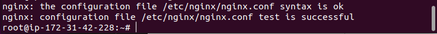

# LEMP IMPLEMENTATION
LEMP is an open source web application stack  used for developing high performance web application. 

This is used all over the world and with the advert of cloud services. Companies can now scale up or down according to their need. The process of implementing LEMP is explained in view to understanding how LEMP works. For this implementation, I connect my local machine with aws server through linux via putty. I used this code, to confirm I was in the right terminal.

`ps -p $$`

### INSTALLATION OF NGINX WEB SERVER
___

By employing the Nginx webserver, Clients or Site visitors can view dynamic pages and gain access to contents that will meet their respective needs.

In order to install Nginx server. First, I had to login to the aws account, I used the ec2 instance of t2 nano family with Ubuntu 20.04LTS.

To install Nginx server, I had to run these commands.

`:~ $: sudo apt update `

`:~ $: sudo apt install nginx`

After, the installation of Nginx server. I had to check the status of Nginx on my terminal.

To check status of Nginx, I used this command.

`:~ $: sudo systemctl status nginx`

Screenshot of Nginx status.

To ascertain that Nginx is correctly  installed on my local machine, I used both the DNS name and the ip address on aws server, by using lines of code below.

`:~ $: curl http://localhost:80`

`:~ $: curl http://127.0.0.1:80`

After which I pinged the ip address of the aws server to check if it was responding.

`:~ $: ping <ip address>`

Screenshot of Nginx- welcome page.

## INSTALLATION OF MYSQL 
___ 

After, the installation of a webserver (Nginx).The server-side will need a database to store data of the website, hence why I installed mySQL on the server. I used this code 

`:~ $: sudo apt install mysql-server`

After, the installation of mySQL, I ran a security script that is pre-installed with mySQL. This script was used to ensure that the database is secure.

To check if I correctly installed mysql, I ran this command. 

`:~ $: sudo mysql` 

### PHP INSTALLATION
___ 

After, installing mySQL on the aws server, I proceed to install PHP, which is the final component in the LEMP stack. PHP is used for developing static websites as well as dynamic websites for users. 

However, Nginx requires an external software to handle PHP processing and act as a bridge between the PHP and the web server, this increases overall performance of the PHP-based application or website. 

To do this I did some extra configurations, which is to install a process manager such as fastCGI process manager; this manager allows Nginx to pass PHP requests to it for processing. In addition, I installed a module called php-mysql to allow easily for easy communicating between PHP and mySQL. I installed the two packages using one line of code:

`sudo apt install php-fpm php-mysql`

After, successfully installing the PHP, I decided to configure the Nginx to use the PHP Processor to handle php requests from users.

### CONFIGURATION OF NGINX TO USE PHP PROCESSOR
___

Nginx has one server block by default which serves html requests or documents in its customized directory "/var/www/html". 

Although, this works well for single site domain,it might be difficult to host or configure multiple domains, hence I create a directory independent of Nginx's customized directory. So that, the Nginx server can be used to server a client request which does not match a website.  
To do this, I ran this command:

`sudo mkdir /var/www/projectLEMP`

I passed some configurations code into this directory. I also activated my configuration using this command:

`sudo ln -s /etc/nginx/sites-available/projectLEMP /etc/nginx/sites-enabled/`

The code above gives instruction to Nginx to use this configuration when next it reloads. I also made sure there was no syntax errors. 
Screenshot below.

I deactivated Nginx host which is currently listening on port 80, using this code.

`sudo unlink /etc/nginx/sites-enabled/default`

To effect this change Nginx must be reloaded using this command.

`sudo systemctl reload nginx`

After, deactivating the default site, I proceed to add some html documents into my projectLEMP folder, I created earlier using these lines of code.

`sudo echo 'Hello LEMP from hostname' $(curl -s http://169.254.169.254/latest/meta-data/public-hostname) 'with public IP' $(curl -s http://169.254.169.254/latest/meta-data/public-ipv4) > /var/www/projectLEMP/index.html`

Screenshot below:

### TESTING MY PHP
___

To test php and ensure Nginx passed it to the php processor earlier configured. I had to ensure that index.php comes before index.html, by changing the configuration. The next step is to create a php file and edit it using Nano editor. I used this command.

`sudo nano /var/www/projectLEMP/info.php` , 

To get information about php server running, I did input this command into the info file: * <?php phpinfo() *;

Screenshot below:

After checking all the necessary information about the php server, I had to remove the file from the Ubuntu server in order to prevent security bridge.

### RETRIEVING DATA FROM MYSQL WITH PHP
___

To demonstrate how to retrieve data from php, I had to first navigate to mySQL environment, using the mySQL command.

`sudo mysql`

The next step is to create a database for a user, I named the database USER. 

Screenshot of database on mysql:

The next step is to create a password that meets the sql requirements to get this I used this command on mysql terminal.

`mysql> SHOW VARIABLES LIKE 'validate_password%';`

Screenshot of result:

After creating the user using this code:

`CREATE USER 'example_user'@ 'localhost' IDENTIFIED WITH mysql_native_password BY 'password';`

where password meets the above requirements.

I used the exit command and logged in as the user, using this code.

`mysql -u example_user -p`

To navigate to the current USER database, I used this command,

`mysql> USE USER`

The next step, I took was to create a simple 'cart' table for items. 

To insert items into the table created, I used the INSERT command in mySQL.

To view the cart table, run this code:

`SELECT * FROM cart;`

Screenshot below:

Finally, I did exit the mysql environment and  created a php file which contains instructions on how to retrieve contents from the database using php language. 

Screenshot below:

